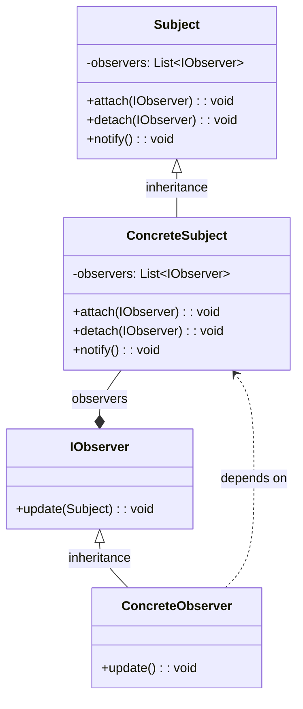

The Observer pattern is a fundamental design pattern in object-oriented programming (OOP) that allows objects to notify other objects about changes to their state. This pattern is a shining example of how the OOP pillars - **Encapsulation**, **Abstraction**, **Inheritance**, and **Polymorphism** - come together to create a robust and scalable solution.
## **Problem Statement**
Imagine a scenario where one object, the **Subject**, needs to notify multiple objects, the **Observers**, about changes to its state. A naive approach would be to have the Subject maintain a list of Observers and notify them directly. However, this approach tightly couples the Subject to the Observers, making it inflexible and prone to errors.

## **The Observer Pattern Solution**
The Observer pattern solves this problem by introducing an intermediary, the **Observer Interface**, which defines the notification method. The Subject maintains a list of Observers, but instead of notifying them directly, it notifies the Observer Interface. The Observers implement this interface, allowing them to receive notifications from the Subject without being tightly coupled.


## **OOP Pillars in Action**

### Encapsulation

The Subject encapsulates its state and notifies the Observers through the Observer Interface, hiding its internal implementation details.

### Abstraction

The Observer Interface provides an abstraction layer, decoupling the Subject from the Observers. This allows for different types of Observers to be added or removed without affecting the Subject.

### Inheritance

The Observers inherit the notification method from the Observer Interface, ensuring that they can receive notifications from the Subject.

### Polymorphism

The Subject can notify multiple types of Observers, each with its own implementation of the notification method, demonstrating polymorphism in action.

 
## Detailed Description of Each Class and Interface of The Example Project
**Subject.cs**

The Subject class is the core of the Observer pattern. It maintains a list of observers and provides methods to attach, detach, and notify them.

-    *Attach(IObserver observer)*: Adds an observer to the list.
-    *Detach(IObserver observer)*: Removes an observer from the list.
-    *Notify()*: Notifies all observers about changes by calling their Update method.

**IObserver.cs**

The IObserver interface defines a single method, Update(Subject subject), which is called by the Subject to notify observers of changes.

**Concretes/User.cs**

The User class represents a user entity. It includes properties for the user's email and name, along with subjects to notify observers about changes in these properties.

 -   *User(string email, string name)*: Constructor to initialize the user with email and name.
 -   *UpdateUserName(string name)*: Updates the user's name and notifies observers.
 -   *UpdateUserEmail(string email)*: Updates the user's email and notifies observers.

**Concretes/UserEmailChangedSubject.cs**

This class inherits from Subject and represents the subject responsible for notifying observers about changes to the user's email.

-    *NewEmail*: The new email address.
-    *OldEmail*: The old email address.

**Concretes/UserNameChangedSubject.cs**

This class inherits from Subject and represents the subject responsible for notifying observers about changes to the user's name.

-    *NewName*: The new name.
-    *OldName*: The old name.

**Concretes/NewsSubscriptionEmailObserver.cs**

This observer sends an email invitation when the user's email changes. It implements the IObserver interface and its Update method checks if the subject is of type UserEmailChangedSubject before sending the email.

**Concretes/NotifyAdminObserver.cs**

This observer notifies administrators about changes in the user's email or name. It implements the IObserver interface and its Update method checks the type of the subject to determine whether it should notify about email or name changes.

**Concretes/WelcomeSmsObserver.cs**

This observer sends an SMS to the user when their name changes. It implements the IObserver interface and its Update method checks if the subject is of type UserNameChangedSubject before sending the SMS.
Usage Example

Here's how the project components are put together and executed in Program.cs:

-    **Create a User**: Instantiate a User object with an initial email and name.
-    **Attach Observers**: Attach instances of NewsSubscriptionEmailObserver and NotifyAdminObserver to the user's email change subject. Attach instances of WelcomeSmsObserver and NotifyAdminObserver to the user's name change subject.
-    **Update Attributes**: Call UpdateUserEmail and UpdateUserName methods on the user object to change the email and name respectively. This triggers the subjects to notify all attached observers.

```csharp

// See https://aka.ms/new-console-template for more information
using ObserverPattern.Concretes;

var user = new user("sadegh@example.com", "XoL");

user.EmailChanged.Attach(new NewsSubscriptionEmailObserver());
user.EmailChanged.Attach(new NotifyAdminObserver());

user.NameChanged.Attach(new SendSmsToUserObserver());
user.NameChanged.Attach(new NotifyAdminObserver());

user.updateuseremail("sadegh@xol.dev");
user.UpdateUserName("Sadegh Xolghadr");
```
In this example:

-    Changing the user's email triggers the NewsSubscriptionEmailObserver and NotifyAdminObserver to perform their respective actions.
-    Changing the user's name triggers the WelcomeSmsObserver and NotifyAdminObserver to perform their respective actions.

## **Benefits**
In conclusion, the Observer pattern is a powerful tool in the OOP toolbox, demonstrating the pillars of OOP in action. By decoupling the Subject from the Observers, it provides a flexible and scalable solution for notifying objects about changes to state.
The Observer pattern offers several benefits, including:

-   **Loose Coupling**: The Subject and Observers are decoupled. A subject doesn't need to know anything about the observers, making it easier to modify or replace either without affecting the other.
-   **Scalability**: The pattern supports multiple observers, allowing you to scale the number of actions that respond to state changes. New Observers can be added or removed without modifying the Subject.
-   **Flexibility**: The pattern allows for different types of Observers to be used. You can add or remove observers at runtime, making the system flexible and easy to extend.
